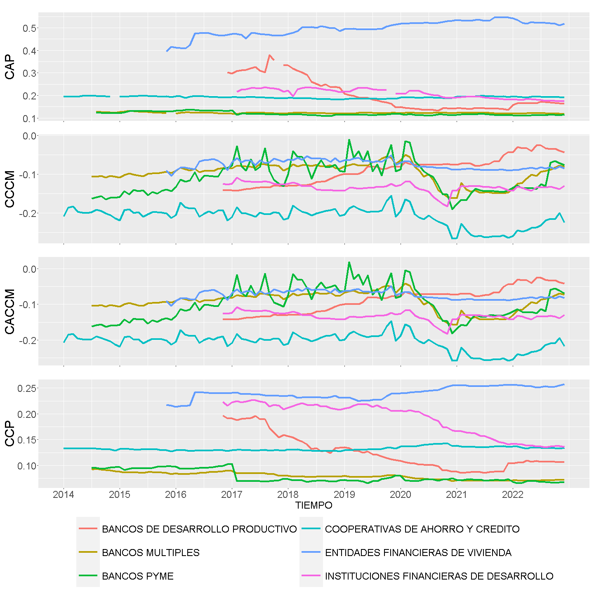

<!-- Configuración CHUNKS -->

### Indicadores de capital

<!-- ##################################################### -->
<!-- #####################  INDICADORES DE CAPITAL         -->
<!-- ##################################################### -->

### Indicadores de activos 

<!-- ##################################################### -->
<!-- #####################  INDICADORES DE ACTIVOS         -->
<!-- ##################################################### -->

### Indicadores de administración 

<!-- ##################################################### -->
<!-- ###############  INDICADORES DE ADMINISTRACION        -->
<!-- ##################################################### -->

### Indicadores de beneficios

<!-- ##################################################### -->
<!-- ###############  INDICADORES DE BENEFICIOS       -->
<!-- ##################################################### -->

### Indicadores de liquidez 

<!-- ##################################################### -->
<!-- ###############  INDICADORES DE LIQUIDEZ           -->
<!-- ##################################################### -->

